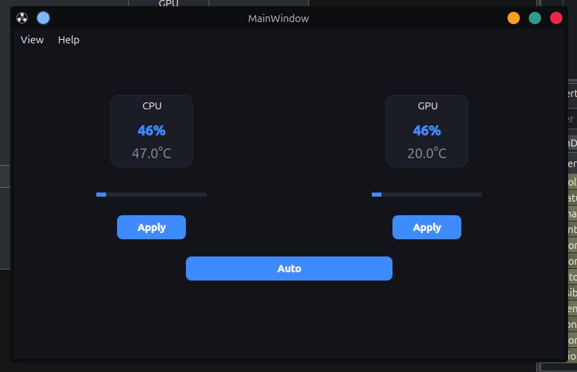

# ❄️ NBFC UI (Linux)

[](http://creativecommons.org/licenses/by-nc/4.0/)
[](https://www.qt.io/)
[](https://isocpp.org/)

A modern, lightweight fan control interface for Linux notebooks. Built with **C++** and **Qt5**, **NBFC UI** provides a sleek and intuitive way to manage your fan speeds and monitor temperatures using the **NBFC (Notebook Fan Control)** system.



---

## ✨ Features

- **🚀 Real-time Monitoring**: Instant feedback on CPU/GPU temperatures and fan speeds.
- **🎮 Independent Control**: Separate sliders for CPU and GPU fan speeds.
- **🔄 Auto Mode**: One-click return to system-managed fan control.
- **⚙️ UI-Based Settings**: Configure everything without touching a text editor.
- **📁 Profile Management**: List, select, and apply NBFC profiles directly from the UI.
- **⚡ Service Control**: Start, stop, or restart the NBFC service with a single click.
- **🎨 Dynamic Themes**: Dark, Light, Blue, and Custom themes with instant application.
- **📦 Portable Assets**: UI files and icons are embedded into the binary.

---

## 🛠️ Installation Guide

Follow these simple steps to install **NBFC UI** on your Linux system.

### 1. Prerequisites
You must have **NBFC-Linux** installed. If not, follow the instructions for your distribution to install it first. Verify it by running:
```bash
nbfc status -a
```

### 2. Download or Clone
Download the source code to your machine.

### 3. Run the Installer
Open a terminal in the project directory and run:
```bash
# Make the scripts executable (if needed)
chmod +x scripts/*.sh

# Run the installation script
./scripts/install.sh
```
The script will automatically:
- Install required build dependencies (`cmake`, `qt5`, etc.).
- Compile the source code.
- Install the binary to `/usr/local/bin`.
- Add **NBFC UI** to your application menu with a proper icon.

### 4. Launching
You can now find **NBFC UI** in your application launcher or run it via terminal:
```bash
NBFC_UI
```

---

## 🎮 How to Use

### Managing Sensors & Settings
1. Go to **Help > Settings** in the menu.
2. **NBFC Binary Path**: Ensure it points to your `nbfc` command.
3. **Sensor Paths**: If temperatures show "N/A", you can manually set the paths (e.g., `/sys/class/thermal/thermal_zone0/temp`).
4. **Interval**: Adjust how fast the UI updates (default is 2000ms).

### Managing NBFC Profiles
In the **Settings** window:
1. Use the **Profile** dropdown to see all available configurations for your laptop.
2. Select your model and click **Apply Profile**.
3. Use the **Start/Restart** buttons if the service is not running.

---

## 🛠️ Management Scripts

- **Test**: Run locally without installing: `./scripts/test.sh`
- **Update**: Pull latest code and reinstall: `./scripts/update.sh`
- **Uninstall**: Remove from system: `./scripts/uninstall.sh`

---

## 📁 Project Structure

```text
nbfc-ui/
├── src/               # C++ Source Code (Logic & Settings Dialog)
├── resources/         # UI Design, Icons, and Qt Resources
├── scripts/           # Install, Test, Update, Uninstall scripts
├── Config.json        # Saved User Configuration & Themes
└── CMakeLists.txt     # Build System Configuration
```

---

## 📝 License

This project is licensed under the **CC BY-NC 4.0** license.
- **Free for personal use.**
- **Commercial use is prohibited.**
- **Attribution is required.**

---
*Developed with ❤️ for the Linux Community.*
